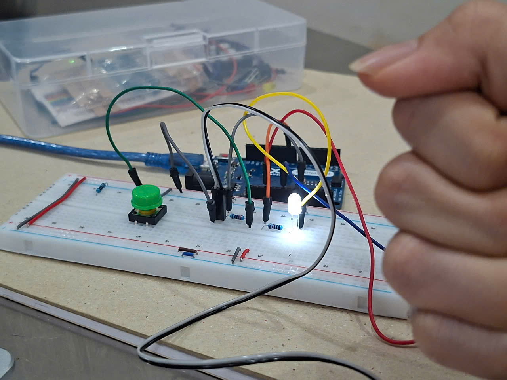
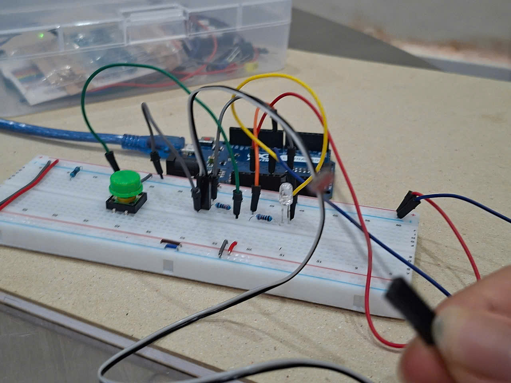

# Buzzer
Buzzer is a device that produce noise. The main function of this is to convert the signal from audio to sound. 
In this picture, I use 2 220 resistors. This is because when the resistor is large, the buzzer has small noise. If we put 2 220 resistors parallel we will get a a 110 resistor. This will help the buzzer lounder.

# Tilt sensor
Tilt sensor is like a switch that can detect basic motion.
the current flow when tilt is upright. But if it tilted the current doesn't flow.

# Light dependent resistor
Light dependent resistor is a type of resistor that changes its resistance based on the amount of light

