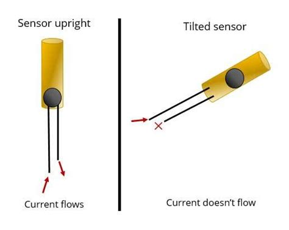

# Buzzer
Buzzer is a device that produce noise. The main function of this is to convert the signal from audio to sound.

# Tilt sensor
Tilt sensor is like a switch that can detect basic motion
the current flow when tilt is upright. But if it tilted the current doesn't flow.

